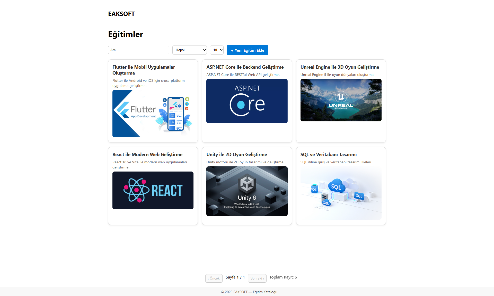
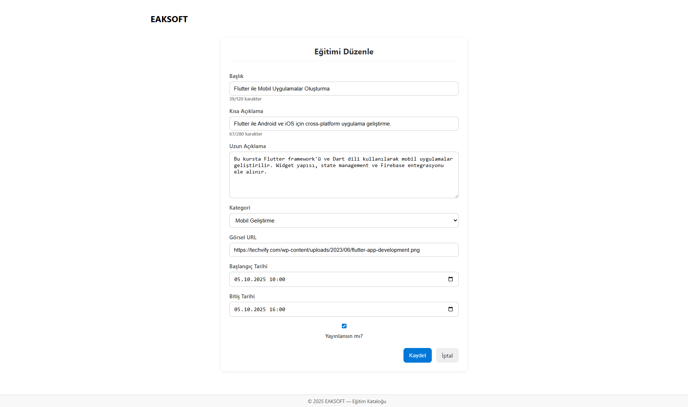
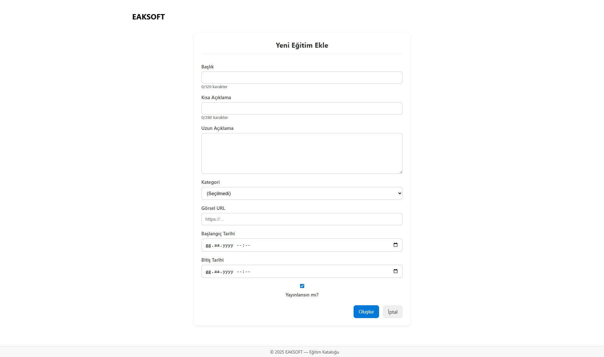

# Training Catalog UI

Eğitim kataloğu için geliştirilen bu proje, eğitmenlerin ve içerik yöneticilerinin eğitimleri listeleyip yönetebilmelerini sağlayan modern bir React arayüzüdür. Uygulama, REST API üzerinden eğitim verilerini alır, filtreleme ve sayfalama destekleriyle kullanıcıların aradıkları içeriğe hızlıca ulaşmasına yardımcı olur.

## Başlıca Özellikler
- 📚 **Eğitim listesi:** Başlık, kısa açıklama ve görselleriyle tüm eğitimleri kart yapısında sunar.
- 🔍 **Arama ve filtreleme:** Başlık/kısa açıklama içinde metin arama, kategoriye göre filtreleme ve sayfa başına kayıt sayısını değiştirme.
- 📄 **Detay sayfası:** Eğitimlerin görsel, açıklama ve zaman bilgilerini tek ekranda gösterir; taslak/yayında durumunu öne çıkarır.
- ✏️ **Oluşturma ve düzenleme:** Yeni eğitim ekleme veya mevcut kaydı güncelleme akışları ile form doğrulamaları içerir.
- 🗑️ **Silme işlemi:** İlgili API üzerinden eğitim silme ve listeye yönlendirme.

## Teknoloji 
- [React 19](https://react.dev/) + [Vite](https://vitejs.dev/) tabanlı SPA mimarisi
- [React Router DOM](https://reactrouter.com/) ile çoklu sayfa yönetimi
- [Axios](https://axios-http.com/) ile HTTP istekleri ve merkezi API istemcisi
- Modern CSS (App.css & component bazlı sınıflar) ile responsive arayüz

## Başlangıç

### Gereksinimler
- Node.js 18+ (Node 20 LTS önerilir)
- npm 9+ (Node ile birlikte gelir)

### Kurulum
```bash
npm install
```

### Geliştirme Sunucusu
```bash
npm run dev
```
Komut çalıştıktan sonra konsolda verilen yerel adresi (varsayılan `http://localhost:5173`) tarayıcıda açarak uygulamayı görüntüleyebilirsiniz. Vite sayesinde kod değişiklikleri otomatik olarak sayfaya yansır.

## Ortam Değişkenleri
Uygulama, API isteklerinde taban adresi için `VITE_API_BASE_URL` değişkenine ihtiyaç duyar. Geliştirme ortamında `.env` dosyanıza aşağıdaki gibi ekleyin:
```bash
VITE_API_BASE_URL=http://localhost:5000
```
> Not: URL değerini kendi backend servisinizin adresine göre güncelleyin. Değer protokolle (`http://` veya `https://`) birlikte yazılmalıdır.

## Beklenen API Uç Noktaları
Arayüz aşağıdaki REST uç noktalarını bekler:

| Metot | URL                     | Açıklama                         |
|-------|------------------------|----------------------------------|
| GET   | `/api/Training`        | Sayfalı eğitim listesi           |
| GET   | `/api/Training/{id}`   | Belirli eğitimin detayları       |
| POST  | `/api/Training`        | Yeni eğitim oluşturma            |
| PUT   | `/api/Training/{id}`   | Mevcut eğitimi güncelleme        |
| DELETE| `/api/Training/{id}`   | Eğitimi silme                    |
| GET   | `/api/Category`        | Kategori listesini görüntüleme   |

Listeleme isteğinde sorgu parametreleri olarak `pageNumber`, `pageSize`, `search`, `categoryId` değerleri gönderilir. API varsayılan olarak yalnızca yayınlanmış (`isPublished`) eğitimleri dönecek şekilde yapılandırılmalıdır.

## Proje Yapısı
```
src/
├─ api/                # Axios tabanlı API istemcisi ve istek yardımcıları
├─ pages/              # Liste, detay ve form ekranları
├─ App.jsx             # Router tanımları ve temel düzen
├─ main.jsx            # React uygulama girişi
├─ App.css, index.css  # Genel stiller
```

## Önizlemeler
- 
- 
- 
- 
  
